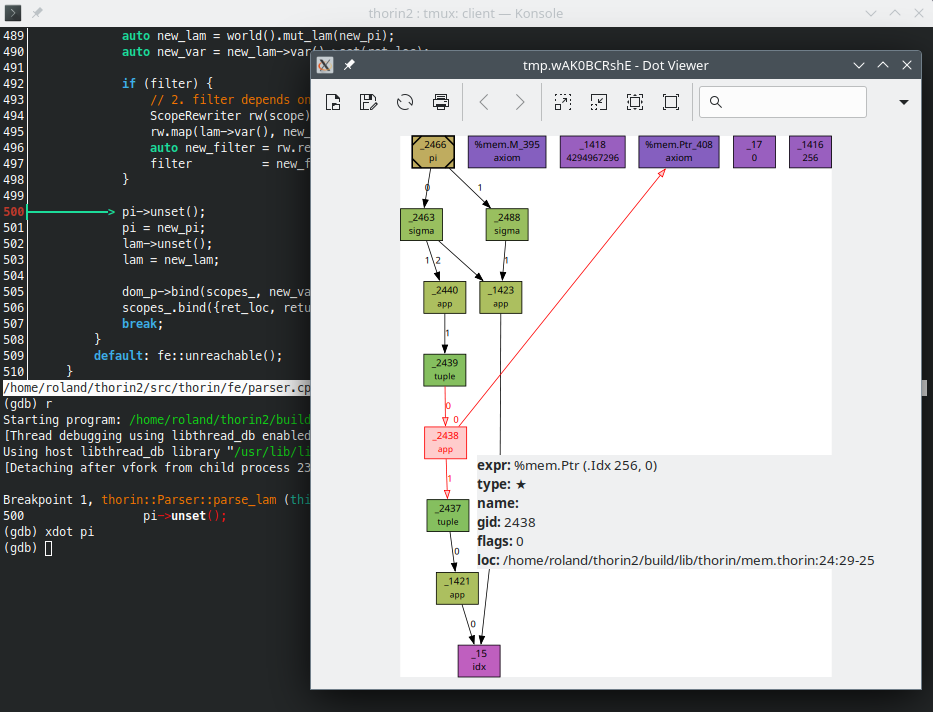

# Coding & Debugging {#coding}

[TOC]

This document comprises some information that is related to coding but not directly to the API.

## Coding Style

Use the following coding conventions:

- Class/Type names in `CamelCase`.
- Constants as defined in an `enum` or via `static const` in `Camel_Snake_Case`.
- Macro names in `SNAKE_IN_ALL_CAPS`.
- Everything else like variables, functions, etc. in `snake_case`.
- Use a trailing underscore suffix for a `private_or_protected_member_variable_`.
- Methods/functions that return a `bool` should be prefixed with `is_`.
- Methods/functions that return a `std::optional` or a pointer that may be `nullptr` should be prefixed with `isa_`.
- Don't do that for a `public_member_variable`.
- Use `struct` for [plain old data](https://en.cppreference.com/w/cpp/named_req/PODType).
- Use `class` for everything else.
- Prefer `// C++-style comments` over `/* C-style comments */`.
- Use `#pragma once` as guard for headers.
- Visibility groups in this order:
  1. `public`
  2. `protected`
  3. `private`

### Doxygen Style

- Use `/// three slashes for Doxygen`.
- Use [Markdown-style](https://doxygen.nl/manual/markdown.html) Doxygen comments.
- Group your functions etc. via [named member groups](https://www.doxygen.nl/manual/grouping.html#memgroup) into logical units.
- Capitalize the group name unless it is directly named after a method.

For all the other minute details like indentation width etc. use [clang-format](https://clang.llvm.org/docs/ClangFormat.html) and the provided `.clang-format` file in the root of the repository.
In order to run `clang-format` automatically on all changed files, switch to the provided [pre-commit](https://pre-commit.com/) hook:

```sh
pre-commit install
```

Note that you can [disable clang-format for a piece of code](https://clang.llvm.org/docs/ClangFormatStyleOptions.html#disabling-formatting-on-a-piece-of-code).
In addition, you might want to check out plugins like the [Vim integration](https://clang.llvm.org/docs/ClangFormat.html#vim-integration).

### Example

Here is an example for a header that follows above conventions:

```cpp
#pragma once

namespace mim {

/// This is a cool class.
class Foo {
public:
    Foo(int foo, int bar)
        : foo_(foo)
        , bar_(bar) {}

    /// @name Getters
    ///@{
    int foo() const { return foo_; }
    int bar() const { return bar_; }
    ///@}

private:
    int foo_;
    int bar_;
}

} // namespace mim
```

## Debugging

@see [Command-Line Reference](@ref clidebug)
@see [GDB: A quick guide to make your debugging easier](https://johnnysswlab.com/gdb-a-quick-guide-to-make-your-debugging-easier/)
@see [Advanced GDB Usage](https://interrupt.memfault.com/blog/advanced-gdb)
@see [Debugging with GDB](https://sourceware.org/gdb/current/onlinedocs/gdb.html/)

### Dumping

Note that you can simply invoke

- mim::Def::dump,
- mim::Def::write,
- mim::World::dump,
- mim::World::write, ...

from within GDB:

```gdb
(gdb) call def->dump()
(gdb) call def->dump(0)
(gdb) call def->dump(3)
(gdb) call world().write("out.mim")
```

In particular, note the different output levels of mim::Def::dump.
What is more, you can adjust the output behavior directly from within GDB by modifying mim::World::flags or mim::World::log:

```gdb
(gdb) call world.flags().dump_gid = 1
(gdb) call world.flags().dump_recursive = 1
(gdb) call world().log().max_level_ = 4
```

Another useful feature is to retrieve a `Def*` from a mim::Def::gid via mim::World::gid2def:

```gdb
(gdb) p world.gid2def(123);
$1 = ...
(gdb) $1->dump();
```

### Display DOT

`scripts/xdot.gdb` provides custom GDB commands to create a [DOT](https://graphviz.org/) graph and display it through [xdot](https://github.com/jrfonseca/xdot.py).
Just source `scripts/xdot.gdb` in your `~/.gdbinit`:

```gdb
source ~/mim/scripts/xdot.gdb
```

Here is the `xdot` GDB command in action:


\include "xdot-help.gdb"

### Conditional Breakpoints

Often, you will want to inspect a certain mim::Def at a particular point within the program.
You can use [conditional breakpoints](https://ftp.gnu.org/old-gnu/Manuals/gdb/html_node/gdb_33.html) for this.
For example, the following GDB command will break, if the mim::Def::gid of variable `def` is `42` in source code location `foo.cpp:23`:

```gdb
break foo.cpp:23 if def->gid() == 42
```

### Catching Throw

For several things like errors in the Mim frontend, MimIR relies on C++ exceptions for error handling.
Do this to encounter them within GDB:

```gdb
catch throw
```

### Valgrind & GDB

If you encounter memory related problems, you might want to run the program with [Valgrind's GDB server](https://valgrind.org/docs/manual/manual-core-adv.html).
Launch the program like this

```sh
valgrind --vgdb=yes --vgdb-error=0 mim-gtest
```

and follow the instructions.

### VS Code

As a utility to make debugging MimIR itself less painful with certain debuggers, the `mim.natvis` file can be loaded for getting more expressive value inspection.
In VS Code you can do so by adding the following to the `launch.json` configurations. When launching from VS Code via CMake, put it in `settings.json`'s `"cmake.debugConfig":`:

```json
"visualizerFile": "${workspaceFolder}/mim.natvis",
"showDisplayString": true,
```

## Tests {#tests}

### lit Tests

Run the [lit](https://llvm.org/docs/CommandGuide/lit.html) testsuite with:

```sh
cmake --build build -t lit
```

You can manually invoke the lit tests like this and maybe filter for a specific test:

```sh
cd lit
./lit ../build/lit -a --filter foo.mim
```

If your _build_ directory, is in fact `build` you can use the `probe.sh` script:

```sh
cd lit
../scripts/probe.sh foo.mim
```

### GoogleTest

Run the [GoogleTest](https://google.github.io/googletest/) unit tests within the `build` folder with:

```sh
ctest
```

In addition, you can enable [Valgrind](https://valgrind.org/) with:

```sh
ctest -T memcheck
```

During debugging you probably only want to run a specifig test case.
You can [filter](https://github.com/google/googletest/blob/main/docs/advanced.md#running-a-subset-of-the-tests) the test cases like this:

```sh
./mim-gtest --gtest_filter="*Loc*"
```

This command lists all available tests:

```sh
./mim-gtest --gtest_list_tests
```

In addition, you may find it helpful to turn assertion failures into debugger breakpoints:

```sh
./mim-test --gtest_break_on_failure
```

## Syntax Highlighting

[This](https://github.com/AnyDSL/vim-mim) Vim plugin provides syntax highlighting for Mim files.

## New Plugins

Check out the [demo](@ref demo) plugin for a minimalistic plugin.
You can create a new in-tree plugin `foobar` based upon the [demo](@ref demo) plugin like this:

```sh
./scripts/new_plugin.sh foobar
```

### Third-Party Plugins

After installing MimIR, third-party plugins just need to find the `mim` package to use your plugin `foo`:

```cmake
cmake_minimum_required(VERSION 3.20 FATAL_ERROR)
project(foo)

find_package(mim)

add_mim_plugin(foo
    SOURCES
        mim/plug/foo/foo.h
        mim/plug/foo/foo.cpp
)
```

Use

```cmake
cmake .. -Dmim_DIR=<MIM_INSTALL_PREFIX>/lib/cmake/mim
```

to configure the project.

### add_mim_plugin

Registers a new MimIR plugin.

```cmake
add_mim_plugin(<plugin-name>
    [SOURCES <source>...]
    [PRIVATE <private-item>...]
    [INSTALL])
```

The `<plugin-name>` is the name of the plugin.
This means, there should be relative to the plugin's `CMakeLists.txt` a file `<plugin-name>.mim` containing annexes.
The command will create two targets:

1. `mim_internal_<plugin-name>`

   This is an internal target to bootstrap the plugin.
   It will generate:
   _`<plugin-name>/autogen.h` for the C++ interface in order to identify annexes,
   _ `<plugin-name>.md`, for the documentation, and \* `<plugin-name>.d` for the plugin's dependencies.
   @note Tracking dependencies via the emitted dependency file is not supported for all CMake generators.
   See [`add_custom_command`'s `DEPFILE` argument](https://cmake.org/cmake/help/latest/command/add_custom_command.html).

2. `mim_<plugin-name>`

   This is the actual `MODULE` [library](https://cmake.org/cmake/help/latest/command/add_library.html).

   - `SOURCES`

     These are the `<source>` files used to build the loadable plugin containing normalizers, passes, and backends.
     One of the source files must export the [`mim_get_plugin`](@ref mim::mim_get_plugin) function.

   - `PRIVATE`

     Furthermore, you can specify additional `<private-item>` build dependencies.

- `INSTALL`

  Specify, if the plugin description, plugin and headers shall be installed with `make install`.
  To export the targets, the export name `mim-targets` has to be exported accordingly (see [`install(EXPORT ..)`](https://cmake.org/cmake/help/latest/command/install.html#export))

You can specify additional properties in the plugin's `CMakeLists.txt`.
For example, the following snippet adds additional include paths for the `MODULE` `mim_<plugin-name>` target:

```
target_include_directories(mim_<plugin-name> <path>...)
```
