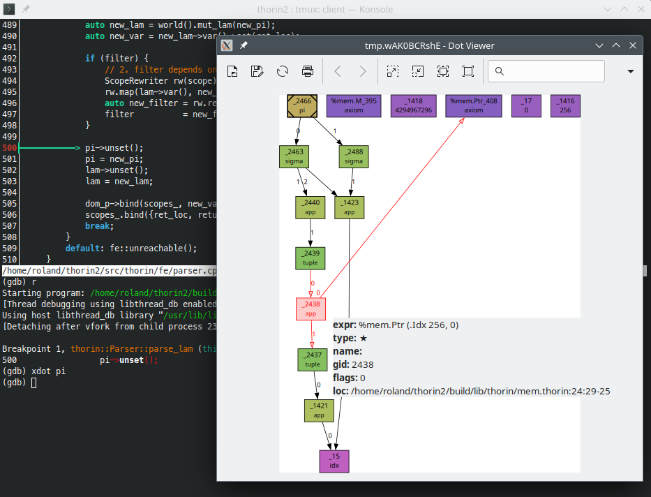

# Coding & Debugging {#coding}

[TOC]

This page collects information that is useful while working on MimIR itself, but is not directly part of the API.

## Building {#building}

If you do not have a [GitHub account set up with SSH](https://docs.github.com/en/authentication/connecting-to-github-with-ssh), you can clone MimIR via HTTPS instead:

```sh
git clone --recursive https://github.com/AnyDSL/MimIR.git
```

The following CMake switches are available:

| CMake Switch            | Options                                  | Default      | Comment                                                                                         |
| ----------------------- | ---------------------------------------- | ------------ | ----------------------------------------------------------------------------------------------- |
| `CMAKE_BUILD_TYPE`      | `Debug` \| `Release` \| `RelWithDebInfo` | `Debug`      | Build type.                                                                                     |
| `CMAKE_INSTALL_PREFIX`  |                                          | `/usr/local` | Install prefix.                                                                                 |
| `MIM_BUILD_DOCS`        | `ON` \| `OFF`                            | `OFF`        | If `ON`, build the documentation <br> (requires Doxygen).                                       |
| `MIM_BUILD_EXAMPLES`    | `ON` \| `OFF`                            | `OFF`        | If `ON`, build the examples.                                                                    |
| `MIM_ENABLE_CHECKS`     | `ON` \| `OFF`                            | `ON`         | If `ON`, enable expensive runtime checks <br> (requires `CMAKE_BUILD_TYPE=Debug`).              |
| `BUILD_TESTING`         | `ON` \| `OFF`                            | `OFF`        | If `ON`, build all unit tests and `lit` tests.                                                  |
| `MIM_LIT_TIMEOUT`       | `<timeout_in_sec>`                       | `20`         | Timeout for `lit` tests. <br> (requires `BUILD_TESTING=ON`).                                    |
| `MIM_LIT_WITH_VALGRIND` | `ON` \| `OFF`                            | `OFF`        | If `ON`, run the Mim CLI in the `lit` tests under Valgrind. <br> (requires `BUILD_TESTING=ON`). |

A typical contributor build with tests and examples enabled looks like this:

```sh
cmake -S . -B build -DCMAKE_BUILD_TYPE=Debug -DBUILD_TESTING=ON -DMIM_BUILD_EXAMPLES=ON
cmake --build build -j$(nproc)
```

### Dependencies

In addition to the provided [submodules](https://github.com/AnyDSL/MimIR/tree/master/external), you will need:

- a recent version of [CMake](https://cmake.org/),
- a C++20-compatible C++ compiler, and
- optionally [LLVM](https://llvm.org/).

Mim emits LLVM IR, but it does _not_ link against LLVM.
So you can simply hand the emitted `*.ll` file to your system's LLVM toolchain.
Strictly speaking, LLVM is not required unless you want to continue from emitted LLVM IR.

## Coding Style

Use the following coding conventions:

- Class/type names use `CamelCase`.
- Constants defined in an `enum` or via `static const` use `Camel_Snake_Case`.
- Macro names use `SNAKE_IN_ALL_CAPS`.
- Everything else - variables, functions, etc. - uses `snake_case`.
- Use a trailing underscore for `private_or_protected_member_variables_`.
- Methods/functions that return a `bool` should be prefixed with `is_`.
- Methods/functions that return a `std::optional` or a pointer that may be `nullptr` should be prefixed with `isa_`.
- Do **not** do this for a `public_member_variable`.
- Use `struct` for [plain old data](https://en.cppreference.com/w/cpp/named_req/PODType).
- Use `class` for everything else.
- Prefer `// C++-style comments` over `/* C-style comments */`.
- Use `#pragma once` as the include guard for headers.
- Order visibility groups like this:
  1. `public`
  2. `protected`
  3. `private`

### CMake Style

- Use 4 spaces for one indentation level.
- Prefer lowercase CMake commands such as `set`, `if`, `foreach`, and `add_subdirectory`.
- Use uppercase names for project-specific CMake variables and options such as `MIM_BUILD_DOCS` or `MIM_PLUGINS`.
- For longer CMake calls, put arguments on separate indented lines instead of cramming everything onto one line.

### Markdown Style

- Use one sentence per line in Markdown prose.
- Do not hard-wrap Markdown text to 80 columns.

<!-- Keep the invisible separator in `M⁠im` so Doxygen does not link this heading to the `mim` namespace in the TOC. -->
### M⁠im Coding Style

- Prefer the primary UTF-8 surface syntax over ASCII-only spellings when writing Mim code and tests.
- Prefer 4 spaces for one indentation level, but aligned layouts may use different spacing when that makes the code clearer.
- Write callable declarations with parenthesized domain groups, for example `lam foo (x: X) (y: Y): Z = ...`.
- Separate curried domain groups with a space, and write the return type as `): Z`, with no space before `:` and one space after it.
- Use spaces after commas in lists and groups: `a, b, c`.
- Write binder ascriptions as `x: X`, but keep literal and bottom ascriptions tight: `23:T`.
- Use `snake_case` for value-level names such as functions, lambdas, binders, local lets, and pattern-bound values.
- Use `CamelCase` for type-level names such as types and type constructors.

### Doxygen Style

- Use `///` for Doxygen comments.
- Use [Markdown-style](https://doxygen.nl/manual/markdown.html) Doxygen comments.
- Group related functions, methods, etc. via [named member groups](https://www.doxygen.nl/manual/grouping.html#memgroup).
- Capitalize the group name unless it is directly named after a method.

For all the smaller details such as indentation width, use [clang-format](https://clang.llvm.org/docs/ClangFormat.html) and the provided `.clang-format` file in the repository root.

To run `clang-format` automatically on changed files, install the provided [pre-commit](https://pre-commit.com/) hook:

```sh
pre-commit install
```

You can also [disable clang-format for a piece of code](https://clang.llvm.org/docs/ClangFormatStyleOptions.html#disabling-formatting-on-a-piece-of-code) when necessary.
Depending on your editor, the [Vim integration](https://clang.llvm.org/docs/ClangFormat.html#vim-integration) and similar plugins may also be useful.

### Example

Here is a small header that follows the conventions above:

```cpp
#pragma once

namespace mim {

/// This is a cool class.
class Foo {
public:
    Foo(int foo, int bar)
        : foo_(foo)
        , bar_(bar) {}

    /// @name Getters
    ///@{
    int foo() const { return foo_; }
    int bar() const { return bar_; }
    ///@}

private:
    int foo_;
    int bar_;
};

} // namespace mim
```

## Debugging

**See also:**

- [Command-Line Reference](@ref clidebug)
- [GDB: A quick guide to make your debugging easier](https://johnnysswlab.com/gdb-a-quick-guide-to-make-your-debugging-easier/)
- [Advanced GDB Usage](https://interrupt.memfault.com/blog/advanced-gdb)
- [Debugging with GDB](https://sourceware.org/gdb/current/onlinedocs/gdb.html/)

### Dumping

You can directly invoke several MimIR dump helpers from within GDB, for example:

- [mim::Def::dump](@ref mim::Def::dump),
- [mim::Def::write](@ref mim::Def::write),
- [mim::World::dump](@ref mim::World::dump),
- [mim::World::write](@ref mim::World::write), ...

```gdb
(gdb) call def->dump()
(gdb) call def->dump(0)
(gdb) call def->dump(3)
(gdb) call world().write("out.mim")
```

In particular, note the different output levels of [mim::Def::dump](@ref mim::Def::dump).

You can also tweak the output behavior directly from within GDB by changing [mim::World::flags](@ref mim::World::flags) or [mim::World::log](@ref mim::World::log):

```gdb
(gdb) call world().flags().dump_gid = 1
(gdb) call world().flags().dump_recursive = 1
(gdb) call world().log().max_level_ = 4
```

Another useful trick is to recover a `Def*` from a [mim::Def::gid](@ref mim::Def::gid) via [mim::World::gid2def](@ref mim::World::gid2def):

```gdb
(gdb) p world().gid2def(123)
$1 = ...
(gdb) call $1->dump()
```

### Displaying DOT Graphs

`scripts/xdot.gdb` provides custom GDB commands to generate a [DOT](https://graphviz.org/) graph and display it with [xdot](https://github.com/jrfonseca/xdot.py).

To enable it, source `scripts/xdot.gdb` from your `~/.gdbinit`:

```gdb
source ~/mim/scripts/xdot.gdb
```

Here is the `xdot` GDB command in action:



\include "xdot-help.gdb"

### Conditional Breakpoints

Often, you will want to inspect a specific [mim::Def](@ref mim::Def) at a particular point in the program.
[Conditional breakpoints](https://ftp.gnu.org/old-gnu/Manuals/gdb/html_node/gdb_33.html) are very handy for this.

For example, the following command breaks if the [mim::Def::gid](@ref mim::Def::gid) of variable `def` is `42` at source location `foo.cpp:23`:

```gdb
break foo.cpp:23 if def->gid() == 42
```

### Catching Exceptions

For several things, such as errors in the Mim frontend, MimIR uses C++ exceptions for error handling.
To stop when an exception is thrown, use:

```gdb
catch throw
```

### Valgrind & GDB

If you run into memory-related problems, it can be useful to run the program with [Valgrind's GDB server](https://valgrind.org/docs/manual/manual-core-adv.html).

Launch the test binary like this:

```sh
valgrind --vgdb=yes --vgdb-error=0 build/bin/mim-gtest
```

and then follow the instructions printed by Valgrind.

## Tests {#tests}

### `lit` Tests

Run the [lit](https://llvm.org/docs/CommandGuide/lit.html) test suite with:

```sh
cmake --build build --target lit
```

You can also invoke the `lit` tests manually and filter for a specific test:

```sh
cd lit
./lit ../build/lit -a --filter foo.mim
```

If your build directory is actually called `build`, you can also use `probe.sh`:

```sh
cd lit
../scripts/probe.sh foo.mim
```

To generate a one-line reproducer for the current checkout and a specific `lit` failure, use:

```sh
./scripts/make_lit_error.sh foo.mim
```

### Triggering Breakpoints

You can tell `mim` to trigger a breakpoint when certain events happen:

```sh
mim test.mim -b 1234            # Break if the node with gid 1234 is created.
mim test.mim -w 1234            # Break if the node with gid 1234 sets one of its operands.
mim test.mim --break-on-alpha   # Break if a check for alpha-equivalence fails.
```

See the [Command-Line Reference](@ref cli) for the full list of flags.

### GoogleTest

Run the [GoogleTest](https://google.github.io/googletest/) unit tests with:

```sh
ctest --test-dir build --output-on-failure
```

You can additionally enable [Valgrind](https://valgrind.org/) via:

```sh
ctest --test-dir build -T memcheck --output-on-failure
```

During debugging, you will usually want to run only a specific test case.
You can [filter](https://github.com/google/googletest/blob/main/docs/advanced.md#running-a-subset-of-the-tests) tests like this:

```sh
build/bin/mim-gtest --gtest_filter="*Loc*"
```

This command lists all available tests:

```sh
build/bin/mim-gtest --gtest_list_tests
```

It can also be useful to turn assertion failures into debugger breakpoints:

```sh
build/bin/mim-gtest --gtest_break_on_failure
```

To generate a one-line reproducer for the current checkout and a specific GoogleTest failure, use:

```sh
./scripts/make_gtest_error.sh "mim.World.dependent_extract"
```

## Syntax Highlighting

[This](https://github.com/AnyDSL/vim-mim) Vim plugin provides syntax highlighting for Mim files.

There is also a [tree-sitter grammar](https://gitlab.com/amaeble/tree-sitter-mim) for Mim files and a [Helix fork](https://github.com/amaebel/helix) with highlight and injection queries.
